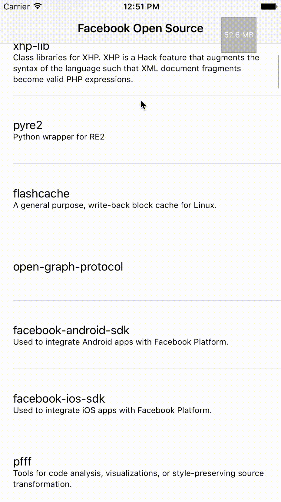

# FBMemoryProfiler
[](https://github.com/Carthage/Carthage)
[]()


An iOS library providing developer tools for browsing objects in memory over time, using [FBAllocationTracker](https://github.com/facebook/FBAllocationTracker) and [FBRetainCycleDetector](https://github.com/facebook/FBRetainCycleDetector).

## About

This library shows how `FBAllocationTracker` and `FBRetainCycleDetector` can cooperate together, and how they can be used in real app.

It uses [FBAllocationTracker](https://github.com/facebook/FBAllocationTracker) to gather information about the objects. 
It supports [generations](https://github.com/facebook/FBAllocationTracker#generations) and [retain cycle detection](https://github.com/facebook/FBRetainCycleDetector).

Here is a small demo (project is [available in Example directory](Example/))



## Installation

### Carthage

To your Cartfile add: 

    github "facebook/FBMemoryProfiler"

`FBMemoryProfiler` is built out from non-debug builds, so when you want to test it, use 

    carthage update --configuration Debug

### CocoaPods

To your podspec add:

    pod 'FBMemoryProfiler'

You'll be able to use `FBMemoryProfiler` fully only in `Debug` builds. This is controlled by [compilation flag](FBMemoryProfiler/FBMemoryProfiler.h#L29) that can be provided to the build to make it work in other configurations.

## Usage

To start using `FBMemoryProfiler` you'll first need to enable `FBAllocationTracker`.

```objc
#import <FBAllocationTracker/FBAllocationTrackerManager.h>

int main(int argc, char * argv[]) {
  [[FBAllocationTrackerManager sharedManager] startTrackingAllocations];
  [[FBAllocationTrackerManager sharedManager] enableGenerations];
  @autoreleasepool {
      return UIApplicationMain(argc, argv, nil, NSStringFromClass([AppDelegate class]));
  }
}
```

To enable memory profiler:

```objc
FBMemoryProfiler *memoryProfiler = [FBMemoryProfiler new];
[memoryProfiler enable];
```

`FBMemoryProfiler` will show up as a button on the screen. Once tapped, it will open memory profiler in full size mode.

We can also define plugins (check below) and [filters for retain cycle detector](https://github.com/facebook/FBRetainCycleDetector#filters), that we pass to configuration.

```objc
_memoryProfiler = [[FBMemoryProfiler alloc] initWithPlugins:@[[IncredibleCacheCleaningPlugin new],
                                                              [AwesomeLoggerPlugin new]]
                           retainCycleDetectorConfiguration:someConfigurationWithCustomFilters;
[_memoryProfiler enable];
```

## Plugins

Plugins are objects that conform to [FBMemoryProfilerPluggable](FBMemoryProfiler/Options/FBMemoryProfilerPluggable.h) protocol. Example usage: [custom cache cleaners](Example/ExampleApp/CacheCleanerPlugin.h), [loggers that log data to server](Example/ExampleApp/RetainCycleLoggerPlugin.h).

## Contributing
See the [CONTRIBUTING](CONTRIBUTING.md) file for how to help out.
